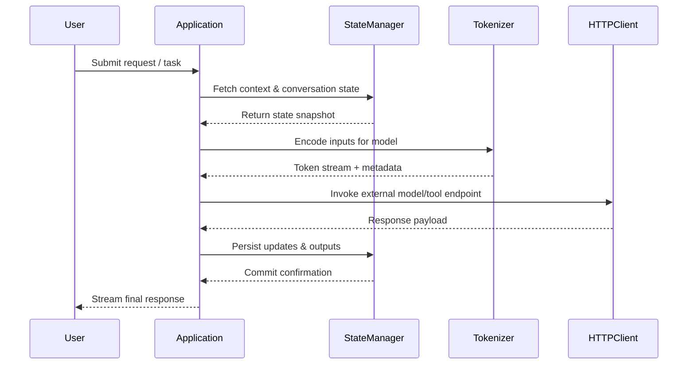
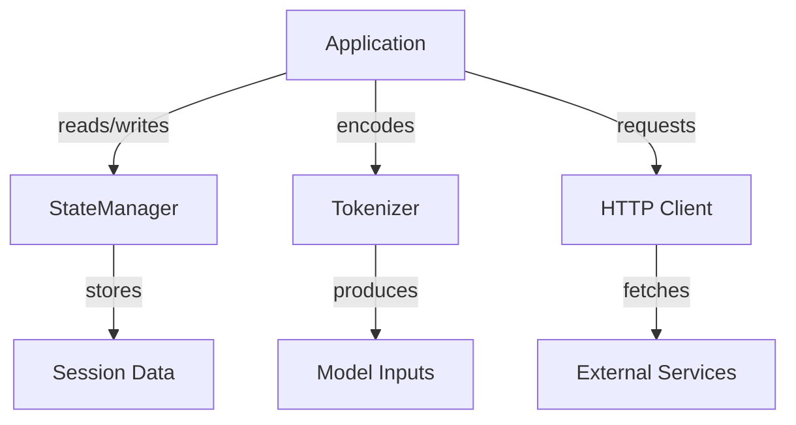

# EpochAI Architecture Overview

This document summarizes the core modules that power EpochAI today and highlights how data flows between them. The focus is on the runtime loop that connects the application surface, state coordination, tokenization, and outbound integrations.

## High-Level Modules

- **Application** (`epochai/Application`)
  - Entry point that wires dependencies, configures logging, and exposes the primary runtime loop.
  - Hosts the orchestration logic that reacts to external inputs and delegates work to the `StateManager`.

- **StateManager** (`epochai/StateManager`)
  - Central authority for shared session state, conversation history, and task metadata.
  - Provides transaction-like APIs for reading and mutating state while maintaining consistency guarantees.

- **Tokenizer** (`epochai/tokenizer`)
  - Handles encoding of user inputs and intermediate artifacts into model-ready tokens.
  - Offers streaming encode/decode helpers to support iterative planning flows.
  - Emits token statistics that feed into learner scoring and roadmap checkpoints.

- **HTTP Client** (`epochai/net/http_client`)
  - Abstraction over network calls to external services (e.g., tools, knowledge bases, model endpoints).
  - Implements retry policies, circuit breakers, and telemetry hooks consumed by the `Application` loop.

## Sequence Flow

## Component Collaboration Diagram

## Operational Considerations

- **Configuration:** Application bootstraps shared configuration (API keys, tokenizer rules) through environment-specific manifests.
- **Observability:** Structured logs emitted from each module feed into a central telemetry pipeline for debugging and performance analysis.
- **Resilience:** Circuit breakers in the HTTP client and snapshotting in the StateManager prevent cascading failures across the system.
- **Extensibility:** Modules expose interfaces that make it straightforward to replace the tokenizer or swap in alternative external clients without refactoring the Application loop.

## Future Enhancements

- Integrate the upcoming tokenizer revamp milestones to simplify experimentation with new token vocabularies.
- Expand the StateManager to support distributed coordination and conflict-free replicated data types (CRDTs).
- Layer learner and autonomy services on top of the Application to complete the autodidact loop described in the roadmap.
